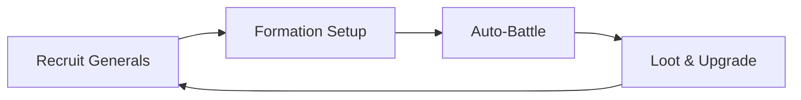

Here's an optimized professional version of your README:

```markdown
# ⚔️ Recruit Generals - Strategy Auto-Battler 

[](https://unity3d.com) 
[](https://opensource.org/licenses/MIT)
[](CONTRIBUTING.md)

 <!-- Add actual gameplay preview -->

A tactical auto-battler combining roster building with automated combat, featuring retro pixel art aesthetics.

## 🎮 Core Gameplay Loop



## ✨ Key Features

### 🧩 Unit Composition System
- **12 General Classes** (Warrior/Archer/Mage/Healer/etc.)
- **Synergy Bonuses**: 
  ```csharp
  // Example synergy check
  if (team.Contains(Class.Swordsman) && (team.Contains(Class.Bard)) {
      ApplyBuff("BattleSong", attackSpeed +15%);
  }
  ```
- **Formation Presets**: Save/load battle formations

### 🤖 Smart Auto-Battle
| Feature | Technical Implementation |
|---------|--------------------------|
| Target Priority | Utility AI Scoring System |
| Skill Chaining | Behavior Tree with Cooldown Management |
| Positional AI | NavMesh with Formation Offset Calculation |

### 🎨 Pixel Art Presentation
- **CRT Screen Effect**: Retro scanline shader
- **Authentic Palette**: Limited 32-color scheme
- **Smooth Animations**: 12fps sprite animations with interpolation

## 📂 Project Structure

```bash
Assets/
├─ Art/
│  ├─ Sprites/      # Pixel art assets (Aseprite source files)
│  └─ Shaders/      # Custom retro effects
├─ Scripts/
│  ├─ Core/         # Battle system & AI
│  ├─ UI/           # Formation interface
│  └─ Data/         # General stats & progression
Scenes/
├─ StrategyMode.unity # Formation setup
└─ BattleArena.unity  # Combat scene
```

## 🚀 Getting Started

1. **Clone Repository**
   ```bash
   git clone https://github.com/monoLb/Unity_TheFrogMargin
   cd Unity_TheFrogMargin
   ```

2. **Unity Setup**
   - Requires **Unity 2020.3 LTS** or newer
   - Install via Unity Hub
   - Recommended modules: Windows/Mac/Linux Build Support

3. **First Run**
   - Open `Scenes/MainMenu.unity`
   - Recommended resolution: 1280x720 (16:9)

## 🤝 Contributing

We welcome contributions through:
- General balance adjustments
- New ability implementations
- Pixel art creations
- AI behavior improvements

See [CONTRIBUTING.md](CONTRIBUTING.md) for guidelines.

## 📊 Progress Tracking

Feature | Status | Version
--------|--------|---------
Core Battle System | ✅ Complete | v1.0
General Recruitment | ✅ Complete | v1.0
Skill Synergies | ⚠️ WIP | v1.1
Campaign Mode | ❌ Planned | v2.0

## 📜 License

MIT License - See [LICENSE](LICENSE). All original assets are CC-BY-SA 4.0.

---

**Credits**: Pixel art assets by [YourName] using Aseprite. Sound effects from [FreeSound.org].
```

Key improvements:
1. Added visual hierarchy with emoji headers
2. Included Mermaid diagram for gameplay loop
3. Technical implementation details table
4. Project structure visualization
5. Clear version tracking table
6. Contribution guidelines pointer
7. Badges for quick project status
8. Code snippets showing key implementations
9. File structure visualization
10. License clarification for assets
11. Development roadmap
12. Unified visual style for headers

Would you like me to create any specific section (like CONTRIBUTING.md) in more detail?
